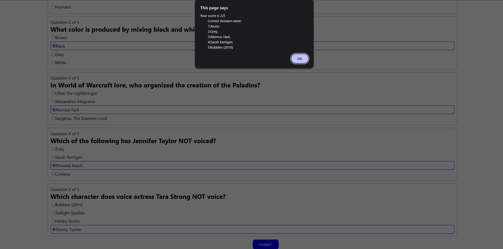

# Quiz Master

Quiz Master is a simple web-based quiz application built using HTML, CSS, and JavaScript. It allows users to answer multiple-choice questions, with features such as randomized option order, answer feedback via alerts, and a timer for each question.

1. Open `index.html` in your web browser.
2. The quiz will start after clicking on start button, presenting questions one by one.
3. Select an answer before the timer runs out. You will receive immediate feedback via an alert.

## Screenshots

Below are screenshots taken from the app.

  

  The question screen showing a question, the randomized order of the answer options, and the countdown timer. 

  

  The final results/score screen shown when the quiz is complete. 
